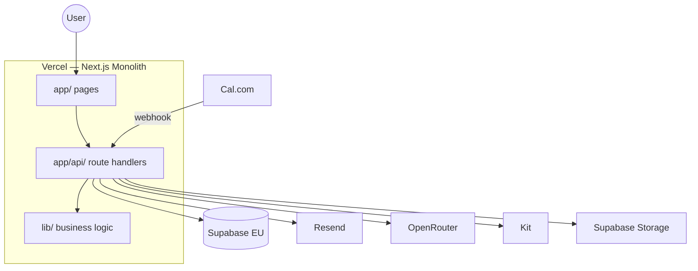

# The Bridge Hub — Architecture Summary

> Synthesized technical overview. Full schema SQL, route contracts, and integration detail:
> [specs/cursor-guide/ARCHITECTURE.md](../specs/cursor-guide/ARCHITECTURE.md)
>
> Last updated: June 2026

---

## System overview

The Bridge Hub is a **single Next.js 14 monolith** deployed on Vercel. There is no separate backend repo or Express service. Supabase provides managed database and auth. External services handle email, AI, and booking.



---

## Frontend and backend split

### Frontend — `app/` + `components/`

| Path | Screen |
|------|--------|
| `app/page.tsx` | S1 Landing |
| `app/begin/page.tsx` | S2 What to expect |
| `app/save/page.tsx` | S3 Email + name capture |
| `app/assessment/page.tsx` | S5 Question shell (104 items) |
| `app/results/page.tsx` | S6 Touchpoint 1 |
| `app/book/page.tsx` | S7 Phone + Cal.com |
| `app/confirmed/page.tsx` | S8 Confirmation |
| `app/resume/page.tsx` | R1 Magic link request |
| `app/expired/page.tsx` | R2 Expired link |

**Client components** (`"use client"`): answer cards, breathing overlay, progress diamonds, section transitions, collapsible results rows, Cal.com embed, cookie consent, localStorage restore.

**Shared components:**
```
components/
  ui/           Button, Card, Input, BandPill, ProgressDiamonds
  assessment/   QuestionShell, AnswerCard, SectionTransition
  results/      SynthesisBlock, CollapsibleRow
  charts/       PSS, PHQ, PCL, MAIA, PID chart components
  layout/       AppShell, Logo, Disclaimer, BreathingOverlay
  pdf/          NervousSystemMap and section components
```

Charts are built once in `components/charts/` and reused in both the results UI and PDF renderer.

### Backend — `app/api/` + `lib/`

```
app/api/
  auth/request-magic-link/    POST
  auth/verify/                GET
  session/create/             POST
  session/save-response/      POST
  session/complete-section/   POST
  session/resume/             GET
  score/calculate/            POST
  results/[session_id]/       GET
  results/generate-ai-content/ POST
  booking/save-phone/         POST
  booking/cal-webhook/        POST  ← triggers PDF + email
  pdf/generate/                 POST  ← server-only
  admin/briefing/[session_id]/ GET
```

```
lib/
  supabase/     client.ts (browser), server.ts (cookies), admin.ts (service role)
  scoring/      pss10, phq8, maia2, pcl5, pid5sf, normative, flags, framework, patterns
  content/      layer2-client.ts, layer2-therapist.ts
  ai/           openrouter.ts, prompts/
  email/        resend templates
  pdf/          generate orchestrator
  data/         questions.ts (104 items)
  report/       section-order.ts
```

---

## Client vs server boundary

| Action | Runs where | Notes |
|--------|------------|-------|
| UI, animations, localStorage | Client | Instant restore; Supabase wins on conflict |
| Auto-save answer | Client → API → Supabase | RLS-scoped |
| Scoring | Server (`lib/scoring/`) | Never in browser |
| OpenRouter calls | Server only | API key protected |
| PDF generation | Server (webhook only) | GDPR: after booking only |
| Results API | Server | Score summaries only |
| Therapist briefing | Server admin + service role | Caroline-only |

### Two Supabase clients

1. **Browser** — `NEXT_PUBLIC_SUPABASE_ANON_KEY` + RLS. User sees only own data.
2. **Server service role** — `SUPABASE_SERVICE_ROLE_KEY`. Used for PDF storage, webhooks, therapist dashboard. **Never imported in client components.**

---

## Data model

Six tables. Full SQL in [ARCHITECTURE.md](../specs/cursor-guide/ARCHITECTURE.md).

| Table | Purpose |
|-------|---------|
| `users` | email, first_name, opted_in |
| `sessions` | status, current_section, current_item, timestamps, touchpoint_ai cache |
| `responses` | item-level answers with reverse_scored flag |
| `scores` | computed totals, bands, percentiles, subscales, flags, dimensional framework |
| `bookings` | phone, cal_booking_id, pdf_generated, pdf_url |
| `magic_links` | token, expires_at (30-day), used |

**RLS:** Enabled on all tables. Users access only their own rows.

---

## Request flows

### Answer save

```
User taps answer
  → Client: POST /api/session/save-response
  → Supabase: upsert response (RLS)
  → Client: update localStorage cache
```

### Section complete

```
Last question in section answered
  → Client: POST /api/session/complete-section
  → Server: lib/scoring/[instrument].ts
  → Supabase: write scores
  → Client: receive band summaries
```

### Results + AI

```
User lands on /results
  → GET /api/results/[session_id]
  → POST /api/results/generate-ai-content ×7 (synthesis, 5 rows, overview — sequential from client)
  → OpenRouter: google/gemini-2.5-flash (TOUCHPOINT_OPENROUTER_MODEL)
  → Cache on sessions.touchpoint_ai (prompt_version: 4)
  → Display Touchpoint 1
```

### Booking + PDF

```
Cal.com BOOKING_CREATED webhook
  → POST /api/booking/cal-webhook
  → Update bookings record
  → POST /api/pdf/generate (React PDF)
  → Store PDF in Supabase Storage
  → Resend: confirmation + PDF delivery email
  → Kit: nurture sequence if opted_in
```

---

## Scoring engine

Source of truth: [specs/chat-03/chat-03-scoring-engine-pseudocode-v2.md](../specs/chat-03/chat-03-scoring-engine-pseudocode-v2.md)

Normative data: [specs/chat-03/chat-03-phase2-normative-data-v2.md](../specs/chat-03/chat-03-phase2-normative-data-v2.md)

- Per-instrument scoring only. **No combined global score.**
- Percentiles via continuous normal CDF (means/SDs from normative doc), not lookup tables
- PCL-5: total + 4 clusters + DSM-5 algorithm
- MAIA-2: 5 subscale averages with reverse scoring
- PID-5-SF: 3 domain averages + facet scores. No AMPD composite. Psychoticism facets (Unusual Beliefs, Perceptual Dysregulation) therapist-only in client report

---

## PDF generation

- **Trigger:** Cal.com webhook on booking confirmation only. Never client-side. Never before booking.
- **Stack:** `@react-pdf/renderer`
- **Fonts:** Embed Cormorant Garamond and Inter as base64 TTF (no Google Fonts CDN)
- **Cover background:** Base64 PNG embedded in component
- **Layer 2:** Pre-written static blocks from `lib/content/layer2-client.ts`
- **Layer 1 + synthesis:** OpenRouter AI per report pseudocode v4

Visual reference: [specs/chat-05/chat-05-sample-client-report-v5.html](../specs/chat-05/chat-05-sample-client-report-v5.html)

---

## AI generation targets

Model: `anthropic/claude-sonnet-4-6` via OpenRouter. All calls server-side.

| Output | Prompt source | Max length |
|--------|---------------|------------|
| S6 synthesis paragraph | chat-05-phase3-copy-v3.md Slot 5a | 2–3 sentences |
| S6 row observations ×5 | chat-05-phase3-copy-v3.md Slot 5b | 1–2 sentences each |
| Report Layer 1 per instrument ×5 | chat-05-report-pseudocode-v4.md | 3–4 sentences |
| Report cross-instrument synthesis | chat-05-report-pseudocode-v4.md | 4–5 sentences |
| Therapist Call Preparation Brief | chat-05-therapist-briefing-v1.md | 4 sections |

Strip internal notes from all AI output: `/\[.*?\]/gs`

---

## Email triggers

All transactional email via Resend. Copy in chat-05-phase3-copy-v3.md.

| Trigger | Channel |
|---------|---------|
| S3 / R1 magic link | Resend |
| S8 booking confirmed | Resend + SMS (manual at launch) |
| S8 + delay | Resend PDF delivery |
| Abandoned session 12h | Kit |
| Completed not booked 48h | Kit |

---

## Environment variables

```
NEXT_PUBLIC_SUPABASE_URL=
NEXT_PUBLIC_SUPABASE_ANON_KEY=
SUPABASE_SERVICE_ROLE_KEY=       # server only, never expose
RESEND_API_KEY=
OPENROUTER_API_KEY=
CAL_WEBHOOK_SECRET=
KIT_API_KEY=
NEXT_PUBLIC_APP_URL=
```

---

## Architectural constraints

1. Supabase **EU region only**
2. Service role key never in client code or committed `.env`
3. PDF triggered server-side from webhook only
4. All AI calls server-side only
5. No health data stored before S3 consent
6. Auto-save on every response — network failure must not lose answers
7. localStorage is instant restore only — Supabase is source of truth

---

## What is NOT built

- No standalone Node/Express API
- No separate React SPA + REST backend
- No Supabase Edge Functions at launch
- No client-side scoring or AI

---

Full detail: [specs/cursor-guide/ARCHITECTURE.md](../specs/cursor-guide/ARCHITECTURE.md)
