# The Bridge Hub — Implementation Roadmap

> Ordered build plan from repo init through launch.
> Aligned with START_HERE build order and ARCHITECTURE.md.
> Last updated: June 2026

---

## Overview

```mermaid
flowchart LR
  subgraph planning [Planning Complete]
    C02[Chat02 Architecture]
    C03[Chat03 Scoring]
    C04[Chat04 UX]
    C05[Chat05 Copy]
    C06[Chat06 Design]
  end
  subgraph build [Build Phases]
    P0[Phase0 Repo]
    P1[Phase1 Data]
    P2[Phase2 Assessment]
    P3[Phase3 Scoring]
    P4[Phase4 Results]
    P5[Phase5 Booking PDF]
    P6[Phase6 Therapist]
    P7[Phase7 Email]
    P8[Phase8 Launch]
  end
  planning --> P0
  P0 --> P1 --> P2 --> P3 --> P4 --> P5 --> P6 --> P7 --> P8
```



**Current position:** Phases 0–2 complete. Supabase migration applied (`npm run db:verify` passes). Smoke test passed (`npm run smoke:test`, 15/15). **Next: Phase 3 — scoring engine.**

---

## How to use review flags

Each phase includes a **screen inventory** (or **infrastructure checklist**) and a **⚑ Review before exit** table. Resolve flags when building that phase — do not pre-decide conflicting spec items here.

| Symbol | Meaning |
|--------|---------|
| **⚑ REVIEW** | Open question; resolve during this phase, then strike through or note resolution |
| **✓ Spec** | Locked in wireframes or cursor-guide; implement as written unless a ⚑ flag says otherwise |

**Authoritative screen structure:** [specs/chat-04/chat-04-wireframe-descriptions-v1.md](../specs/chat-04/chat-04-wireframe-descriptions-v1.md)

**Copy slots:** [specs/cursor-guide/COPY_REFERENCE.md](../specs/cursor-guide/COPY_REFERENCE.md) (may conflict with wireframes — flagged, not merged)

**Visual wireframes PDF:** [specs/chat-04/chat-04-wireframes-v1.pdf](../specs/chat-04/chat-04-wireframes-v1.pdf)

### Cross-cutting doc conflicts

Resolve these per phase; do not merge silently.

| Topic | Conflict | Where to decide |
|-------|----------|-----------------|
| Disclaimer placement | START_HERE / COPY_REFERENCE say "every screen"; wireframes exclude S4, S5, S7 | Per-screen flags in Phases 2, 4, 5 |
| S1 CTA copy | COPY_REFERENCE: "Begin your map"; wireframe: "Begin the screening" | Phase 2 — S1 |
| Cookie consent | Listed in Phase 2 and Phase 8 | Phase 2 builds UI; Phase 8 links to legal pages |
| S3 health consent | Phase 8 lists consent; S3 built in Phase 2 | Phase 2 builds checkbox; Phase 8 supplies policy text |
| Chat 03 phases 3.3–3.4 | [current-status.md](current-status.md) says pending; scoring roadmap closeout table says complete | Phase 3 — confirm before implementing `patterns.ts` |
| Magic link emails | Phase 1 + Phase 7 both mention | Phase 1 owns sending; Phase 7 owns automated triggers only |

---

## Phase 0 — Repo and environment

**Goal:** Runnable Next.js project connected to Supabase and Vercel.

- [x] Create GitHub repo `bridge-hub`
- [x] Copy specs into `specs/`
- [x] Create documentation in `docs/`
- [x] Initialize Next.js 14 App Router + Tailwind with DESIGN_SYSTEM tokens
- [x] Create Supabase project (EU region)
- [x] Configure environment variables (Phase 0–1 in `.env.bridgehub`):
  - `NEXT_PUBLIC_SUPABASE_URL`
  - `NEXT_PUBLIC_SUPABASE_ANON_KEY`
  - `SUPABASE_SERVICE_ROLE_KEY`
  - `RESEND_API_KEY`
  - `NEXT_PUBLIC_APP_URL`
- [x] Link Vercel project to GitHub (auto-deploy)
- [x] Dev tooling: `npm run dev` / `npm run start` load `.env.bridgehub`; `npm run smoke:test` for API smoke checks

### Infrastructure checklist

- Next.js 14 App Router
- Tailwind tokens from [DESIGN_SYSTEM.md](../specs/cursor-guide/DESIGN_SYSTEM.md)
- `.env.bridgehub` for secrets (never commit; loaded via `next.config.mjs`)
- Vercel project linked to GitHub
- Supabase project in EU region

### ⚑ Review before exit

| Flag | Area | Question |
|------|------|----------|
| ~~⚑~~ | Tailwind tokens | **Resolved Phase 0:** `tailwind.config.ts` uses DESIGN_SYSTEM palette (warm-paper, ink, etc.) |
| ~~⚑~~ | `.env.example` | **Resolved Phase 0:** `.env.bridgehub` (local secrets) + `.env.example` (committed template) |
| ~~⚑~~ | Env vars | **Resolved Phase 0:** `.env.bridgehub` holds Phase 0–1 only; later keys added when those phases start |

**Exit criteria:** Empty Next.js app deploys to Vercel; Supabase project exists in EU.

---

## Phase 1 — Data layer

**Goal:** Database schema, RLS, and magic link auth.

**Reference:** [specs/cursor-guide/ARCHITECTURE.md](../specs/cursor-guide/ARCHITECTURE.md)

- [x] Implement Supabase schema (SQL in [supabase/migrations/001_initial_schema.sql](../supabase/migrations/001_initial_schema.sql))
  - Applied via `npm run db:migrate` (or Supabase SQL Editor)
  - `users`, `sessions`, `responses`, `scores`, `bookings`, `magic_links`
  - `safety_flags` (no user-facing RLS policies)
- [x] Migration scripts: `npm run db:migrate`, `npm run db:verify`
- [x] Enable RLS on all tables except `safety_flags` (in migration)
- [x] Create `lib/supabase/client.ts`, `server.ts`, `admin.ts`, `route.ts`
- [x] Magic link auth:
  - `POST /api/auth/request-magic-link`
  - `GET /api/auth/verify`
- [x] Session creation: `POST /api/session/create`
- [x] Session resume: `GET /api/session/resume`
- [x] Supabase Storage bucket `reports` (in migration)

### Infrastructure checklist

- Schema, RLS, `lib/supabase/*`
- Magic link routes (S3, R1, R2)
- Session create and resume endpoints
- Storage bucket for report PDFs

### ⚑ Review before exit

| Flag | Area | Question |
|------|------|----------|
| ⚑ | `complete-section` API | ARCHITECTURE returns `{ scores, flags }` — confirm flags never reach client response |
| ~~⚑~~ | Magic link scope | **Resolved Phase 1:** Phase 1 owns Resend magic links; Phase 7 adds scheduled triggers only |
| ~~⚑~~ | Storage bucket | **Resolved Phase 1:** `reports` bucket created in migration SQL |

**Exit criteria:** User can submit email at S3, receive magic link, authenticate, and have a session record.

**Critical constraint:** `safety_flags` accessible only via service role. Enforce at schema level, not application layer alone.

---

## Phase 2 — Assessment flow

**Goal:** Full screening experience from landing through question 115.

**Reference:** [specs/chat-04/chat-04-wireframe-descriptions-v1.md](../specs/chat-04/chat-04-wireframe-descriptions-v1.md)

- [x] Routes S1–S5: `/`, `/begin`, `/save`, `/assessment`
- [x] Routes R1–R2: `/resume`, `/expired`
- [x] Question data: 115 items in `lib/data/questions.ts` from [specs/questionnaire/bridge-hub-questionnaire-reference.md](../specs/questionnaire/bridge-hub-questionnaire-reference.md)
- [x] Section transition screens (S4) with section tones
- [x] Auto-save per answer: `POST /api/session/save-response` + localStorage cache
- [x] Progress indicator: five diamonds, connecting line fill
- [x] Breathing overlay ("Take a breath" — never auto-plays)
- [x] PCL-5 optional write-in field
- [x] Forward-only navigation (no back button; browser back blocked)
- [x] Cookie consent banner on S1 (first visit only)
- [x] Smoke test: session create, save-response, resume, magic-link verify (`scripts/smoke-test.mjs`)

### Screen inventory

**S1 `/` — Landing**

- ✓ Urgent help link (top right) → support page
- ✓ Portrait, wordmark, headline, subline (time estimate)
- ✓ CTA button
- ✓ Disclaimer footer
- ✓ Cookie consent banner (first visit only)
- ⚑ REVIEW: CTA copy — "Begin your map" vs "Begin the screening"
- ⚑ REVIEW: Support page URL — stub route now or external link?
- ⚑ REVIEW: Caroline portrait asset — which file in `specs/assets/`?

**S2 `/begin` — What to expect**

- ✓ Top bar: wordmark + breathing button
- ✓ Heading, breathing intro block, 4 trust items, credibility line, CTA
- ✓ Disclaimer
- ⚑ REVIEW: Exact background tone ("lighter than S1" — Chat 06)

**Breathing overlay** (S2 + S5)

- ✓ Full-screen dark overlay, circle animation, stage labels, close button
- ✓ Never auto-plays; returns to same question

**S3 `/save` — Email + name**

- ✓ Form: first name, email, Kit opt-in checkbox (default unchecked)
- ✓ GDPR consent block with privacy policy link
- ✓ CTA (disabled until valid), disclaimer
- ⚑ REVIEW: Consent copy final — Chat 05 vs Chat 10 privacy policy (policy page may not exist yet)
- ⚑ REVIEW: "No health data before S3 consent" — confirm submit = consent moment

**S4 — Section transitions (×5)**

- ✓ Atmospheric background per section, section name, intro copy, auto-advance ~2.5s
- ✓ NO disclaimer, NO breathing button, NO CTA
- ⚑ REVIEW: Disclaimer rule — wireframe excludes; global rules say "every screen"

**S5 `/assessment` — Question shell**

- ✓ Header: section name, breathing button, progress diamonds
- ✓ Question number (within section), question text, answer cards, wordmark
- ✓ Forward-only, auto-save, no disclaimer, no back button
- ~~⚑ REVIEW: Browser back button — block during assessment? (START_HERE says yes)~~ **Resolved:** blocked in `AssessmentFlow`
- ⚑ REVIEW: Final question → redirect to `/results` — trigger scoring first? (Phase 3)

**5d — PCL-5 optional write-in** (before PCL-5 questions)

- ✓ Optional text field after Section 4 transition
- ⚑ REVIEW: Skip behaviour — can user skip entirely?

**R1 `/resume` — Re-entry**

- ✓ Email field, "Send my resume link", helper text, escape hatch, wordmark
- ⚑ REVIEW: No disclaimer in wireframe — add one per global rule?
- ⚑ REVIEW: "Start new screening" — creates new session or overwrites?

**R2 `/expired` — Expired link**

- ✓ Same pattern as R1 with expired messaging
- ⚑ REVIEW: Disclaimer — same as R1

### ⚑ Review before exit

| Flag | Area | Question |
|------|------|----------|
| ⚑ | Disclaimer map | Final list of which routes show disclaimer (S1, S2, S3, S6, S8 vs R1, R2, S7, S4, S5) |
| ⚑ | Screen copy | Wireframe boards vs COPY_REFERENCE — extract final copy per slot |
| ⚑ | Section row labels | S6 preview uses "Life lately" for section 2; locked name is "The Fog" — align before Phase 4 |

**Exit criteria:** User can complete all 115 questions; answers persist across page refresh and magic link resume. **Met** — verified via smoke test (June 2026).

---

## Phase 3 — Scoring engine

**Goal:** Per-instrument scoring on section completion with safety flag routing.

**Reference:** [specs/chat-03/chat-03-scoring-engine-pseudocode-v2.md](../specs/chat-03/chat-03-scoring-engine-pseudocode-v2.md)

- [ ] Implement `lib/scoring/`:
  - `pss10.ts`, `phq8.ts`, `maia2.ts`, `pcl5.ts`, `pid5sf.ts`
  - `normative.ts` (continuous normal CDF, not lookup tables)
  - `flags.ts`, `framework.ts`, `patterns.ts`
- [ ] `POST /api/session/complete-section` triggers scoring per instrument
- [ ] Run `framework.ts` + `patterns.ts` after all 5 instruments scored (not per-section)
- [ ] Store results in `scores` table
- [ ] Safety flags → `safety_flags` table via service role only
- [ ] Section timing captured (`section_start`, `section_end`)

### Infrastructure checklist

- Per-instrument scoring on section completion
- Cross-instrument framework (Q1–Q8) and named patterns after section 5
- Safety flag routing isolated from client APIs

### ⚑ Review before exit

| Flag | Area | Question |
|------|------|----------|
| ⚑ | Cross-instrument timing | Run Q1–Q8 + named patterns once all 5 instruments scored — on last `complete-section` or on first `/results` load? |
| ⚑ | Chat 03 3.3–3.4 | Reconcile [current-status.md](current-status.md) vs scoring roadmap closeout before building `patterns.ts` |
| ⚑ | `POST /api/score/calculate` | Separate public route or internal-only helper called from `complete-section`? |
| ⚑ | Safety flags in API | Ensure no client route returns flag data (ARCHITECTURE `complete-section` response) |
| ⚑ | Completion quality | <15 min flag — surface where? (therapist only per scoring roadmap) |

**Exit criteria:** Completing all 5 sections produces score records with bands, percentiles, subscales, and pattern flags. Safety flags never appear in client API responses.

---

## Phase 4 — Results (Touchpoint 1)

**Goal:** Post-completion screen that surfaces insights and drives booking.

**Reference:** [specs/chat-05/chat-05-phase3-copy-v3.md](../specs/chat-05/chat-05-phase3-copy-v3.md)

- [ ] Route `/results` (S6)
- [ ] Static copy slots 1–4 (headline, credibility, full report block, Clarity Call paragraph)
- [ ] `GET /api/results/[session_id]` — scores, patterns, top items (no flags)
- [ ] `POST /api/results/generate-ai-content` — OpenRouter for:
  - Synthesis paragraph (Slot 5a)
  - Five collapsible row observations (Slot 5b)
- [ ] Collapsible section rows with chevron animation
- [ ] CTA: "Book your free Clarity Call" → `/book`

### Screen inventory — S6 `/results`

- ✓ Block 1: eyebrow, headline (Slot 1), synthesis AI (Slot 5a), credibility (Slot 2)
- ✓ Block 2: five collapsible rows (Slot 5b), dot colours, accordion (one open)
- ✓ Block 3: full report note (Slot 3)
- ✓ Block 4: Clarity Call badge, paragraph (Slot 4), CTA → `/book`
- ✓ Block 5: disclaimer, urgent help link, wordmark
- ⚑ REVIEW: Row header labels — use locked section names (The Load, The Fog…) or wireframe shorthand (Stress load, Life lately…)?
- ⚑ REVIEW: AI content caching — generate once and store, or regenerate on refresh?
- ⚑ REVIEW: Loading state while AI generates — skeleton, spinner, or static-first then hydrate?
- ⚑ REVIEW: Urgent help link destination — same as S1 support page
- ⚑ REVIEW: Breathing button on S6? (not in wireframe)

### ⚑ Review before exit

| Flag | Area | Question |
|------|------|----------|
| ⚑ | Scoring dependency | Confirm Phase 3 cross-instrument scoring complete before S6 renders |
| ⚑ | PDF timing | Confirm no PDF generation or download on S6 (booking only) |

**Exit criteria:** Completed user sees personalised Touchpoint 1 with AI-generated synthesis and row observations.

---

## Phase 5 — Booking + PDF

**Goal:** Cal.com booking triggers Nervous System Map PDF delivery.

**Reference:** [specs/chat-05/chat-05-report-pseudocode-v4.md](../specs/chat-05/chat-05-report-pseudocode-v4.md), [specs/chat-05/chat-05-sample-client-report-v5.html](../specs/chat-05/chat-05-sample-client-report-v5.html)

- [ ] Route `/book` (S7): phone capture + Cal.com inline embed
- [ ] `POST /api/booking/save-phone`
- [ ] `POST /api/booking/cal-webhook` on `BOOKING_CREATED`
- [ ] React PDF components in `components/pdf/`:
  - Cover page with base64 embedded background
  - Five instrument sections with charts
  - Layer 2 blocks from `lib/content/layer2-client.ts`
  - Layer 1 AI narratives (OpenRouter)
  - Addendum with full response tables
- [ ] `POST /api/pdf/generate` (server-only, webhook-triggered)
- [ ] Store PDF in Supabase Storage; update `bookings.pdf_url`
- [ ] Route `/confirmed` (S8)
- [ ] Confirmation email via Resend (copy from phase3-copy v3)
- [ ] Kit nurture opt-in if `opted_in = true`

### Screen inventory — S7 `/book`

- ✓ Header: eyebrow, heading
- ✓ Your details card (name + email pre-filled, locked)
- ✓ Mobile number block (optional — not blocking)
- ✓ Cal.com inline embed
- ✓ Wordmark
- ⚑ REVIEW: No disclaimer in wireframe — add footer disclaimer?
- ⚑ REVIEW: Phone required vs optional — wireframe says optional; confirm for SMS reminder
- ⚑ REVIEW: Cal.com free plan embed config (Chat 09)

### Screen inventory — S8 `/confirmed`

- ✓ Booking summary card, what-happens-next steps (×3)
- ✓ Disclaimer, wordmark
- ✓ Triggers: PDF gen, Resend email, Kit if opted in
- ⚑ REVIEW: SMS reminder — ARCHITECTURE mentions; include at launch or defer?
- ⚑ REVIEW: User waits on S8 while PDF generates, or async email only?

### PDF (not a route — webhook-triggered)

- ✓ Cover, 5 instrument sections + charts, Layer 2 client blocks, Layer 1 AI, addendum
- ⚑ REVIEW: Split Phase 5 into 5a (booking UI + webhook stub) and 5b (PDF) — optional sequencing
- ⚑ REVIEW: `background_Serene_lakeside_mist_with_botanical_accents.png` — **not in repo**; add to assets before cover page
- ⚑ REVIEW: Layer 1 AI in PDF — same OpenRouter prompts as report pseudocode v4; confirm token budget / failure fallback

### ⚑ Review before exit

| Flag | Area | Question |
|------|------|----------|
| ⚑ | PDF timing | Locked: S8 only — no exceptions |
| ⚑ | Kit opt-in | Fires here if `opted_in` from S3 — confirm API |

**Exit criteria:** Booking confirmation generates PDF, sends email with attachment. PDF never generated before booking.

**Critical constraint:** PDF generates on S8 booking confirmation ONLY. GDPR position — do not change.

---

## Phase 6 — Therapist dashboard (private)

**Goal:** Caroline-only view of clinical briefing and safety flags.

**Reference:** [specs/chat-05/chat-05-therapist-briefing-v1.md](../specs/chat-05/chat-05-therapist-briefing-v1.md)

- [ ] Admin routes with service role authentication
- [ ] `GET /api/admin/briefing/[session_id]`
- [ ] Safety alert block (conditional, top of briefing)
- [ ] Call Preparation Brief (OpenRouter, 4 sections)
- [ ] Clinical Layer 2 blocks from `lib/content/layer2-therapist.ts`
- [ ] Dimensional framework output (Q1–Q8)
- [ ] Named pattern observations
- [ ] Safety flag review UI

### ⚑ Review before exit

| Flag | Area | Question |
|------|------|----------|
| ⚑ | Admin auth | How Caroline logs in — env password, Supabase admin user, or Vercel protection? |
| ⚑ | Safety flag UI | Mark reviewed workflow — needed at launch or post-launch? |
| ⚑ | Layer 2 source | Therapist blocks from `chat-03-layer2-content-library-v2.md` only — never client blocks |
| ⚑ | PID-5 facets | Unusual beliefs + Perceptual dysregulation — therapist only (START_HERE) |

**Exit criteria:** Caroline can view full clinical picture including safety flags. No client-facing route exposes this data.

---

## Phase 7 — Email automation (Chat 08)

**Goal:** Nurture sequences and re-engagement triggers.

- [ ] Kit API integration for opt-in subscribers
- [ ] Abandoned session reminder (12h after email capture, no completion)
- [ ] Completed-not-booked follow-up (48h after completion)

Note: Magic link emails (S3, R1, R2) are owned by **Phase 1** — Phase 7 adds scheduled triggers only.

### ⚑ Review before exit

| Flag | Area | Question |
|------|------|----------|
| ⚑ | 12h abandoned | Cron on Vercel, Supabase edge function, or external? |
| ⚑ | 48h completed-not-booked | Same mechanism |
| ⚑ | Copy source | Confirm templates in phase3-copy v3 |

**Exit criteria:** Automated emails fire on defined triggers. Copy already exists in phase3-copy v3 and Chat 08 scope.

---

## Phase 8 — Compliance and launch (Chat 10–11)

**Goal:** Legal compliance, QA, soft launch.

- [ ] Privacy policy page (target for S3 consent link and cookie banner "Manage")
- [ ] Terms of use page
- [ ] Right-to-delete flow (data layer)
- [ ] Finalise S3 consent copy against privacy policy
- [ ] Mobile testing (390px primary)
- [ ] Accessibility audit
- [ ] QA checklist against wireframe descriptions
- [ ] Soft launch with first-week monitoring

### Screen inventory — legal / support pages (new routes)

- Privacy policy (`/privacy` or external?)
- Terms of use
- Support / urgent help destination (linked from S1, S6)
- Right-to-delete flow (UI TBD)

### ⚑ Review before exit

| Flag | Area | Question |
|------|------|----------|
| ⚑ | Chat 10 | Privacy policy + terms drafts not started |
| ⚑ | Delete flow | Self-serve vs email request |
| ⚑ | QA | Run wireframe checklist against all 10 screens (S1–S8, R1, R2) |
| ⚑ | Mobile | 390px primary — test every screen |

**Exit criteria:** App is GDPR-compliant and live for first users.

---

## Pre-build planning gaps

These can run in parallel with Phases 1–2. They block therapist briefing polish, not core assessment.

**When building:** resolve items marked ⚑ in each phase's review table first. This table covers planning-only work that has no phase task yet.

| Gap | Owner | Blocks | Phase flag |
|-----|-------|--------|------------|
| Chat 03 Phase 3.3 — edge cases | Chat 03 | Therapist briefing edge cases | Phase 3 ⚑ Chat 03 3.3–3.4 |
| Chat 03 Phase 3.4 — AI pattern library structure | Chat 03 | AI briefing accuracy | Phase 3 ⚑ Chat 03 3.3–3.4 |
| Chat 03 Phases 4–6 — archetypes, PDF spec, briefing system | Chat 03 | Report Layer 1 polish | Phase 5 ⚑ Layer 1 AI |
| Chat 10 — privacy policy and terms | Chat 10 | Launch | Phase 8 ⚑ Chat 10 |
| PDF cover background asset verification | Design | Phase 5 | Phase 5 ⚑ cover background |

---

## Dependency graph

```
Phase 0 (repo/env)
  └── Phase 1 (data/auth)
        └── Phase 2 (assessment UI)
              └── Phase 3 (scoring)
                    └── Phase 4 (results)
                          └── Phase 5 (booking + PDF)
                                ├── Phase 6 (therapist dashboard)
                                └── Phase 7 (email automation)
                                      └── Phase 8 (compliance + launch)
```

Phases 6 and 7 can partially overlap after Phase 5 webhook is working.

---

## Success metrics at launch

1. User completes 115-question screening without data loss
2. Touchpoint 1 displays within seconds of completion
3. Booking triggers PDF delivery to email
4. Safety flags visible to therapist only
5. Magic link resume works across devices (30-day expiry)

---

See [current-status.md](current-status.md) for what is already complete in planning.
