# The Bridge Hub — Implementation Roadmap

> Ordered build plan from repo init through launch.
> Aligned with START_HERE build order and ARCHITECTURE.md.
> Last updated: June 2026

---

## Overview

```mermaid
flowchart LR
  subgraph planning [Planning Complete]
    C02[Chat02 Architecture]
    C03[Chat03 Scoring]
    C04[Chat04 UX]
    C05[Chat05 Copy]
    C06[Chat06 Design]
  end
  subgraph build [Build Phases]
    P0[Phase0 Repo]
    P1[Phase1 Data]
    P2[Phase2 Assessment]
    P3[Phase3 Scoring]
    P4[Phase4 Results]
    P5[Phase5 Booking PDF]
    P6[Phase6 Therapist]
    P7[Phase7 Email]
    P8[Phase8 Launch]
  end
  planning --> P0
  P0 --> P1 --> P2 --> P3 --> P4 --> P5 --> P6 --> P7 --> P8
```



**Current position:** Phase 0 partially complete (this repo with docs and specs). Application code not yet started.

---

## Phase 0 — Repo and environment

**Goal:** Runnable Next.js project connected to Supabase and Vercel.

- [x] Create GitHub repo `bridge-hub`
- [x] Copy specs into `specs/`
- [x] Create documentation in `docs/`
- [ ] Initialize Next.js 14 App Router + Tailwind with DESIGN_SYSTEM tokens
- [ ] Create Supabase project (EU region)
- [ ] Configure environment variables:
  - `NEXT_PUBLIC_SUPABASE_URL`
  - `NEXT_PUBLIC_SUPABASE_ANON_KEY`
  - `SUPABASE_SERVICE_ROLE_KEY`
  - `RESEND_API_KEY`
  - `OPENROUTER_API_KEY`
  - `CAL_WEBHOOK_SECRET`
  - `KIT_API_KEY`
  - `NEXT_PUBLIC_APP_URL`
- [ ] Link Vercel project to GitHub (auto-deploy)

**Exit criteria:** Empty Next.js app deploys to Vercel; Supabase project exists in EU.

---

## Phase 1 — Data layer

**Goal:** Database schema, RLS, and magic link auth.

**Reference:** [specs/cursor-guide/ARCHITECTURE.md](../specs/cursor-guide/ARCHITECTURE.md)

- [ ] Implement Supabase schema:
  - `users`, `sessions`, `responses`, `scores`, `bookings`, `magic_links`
  - `safety_flags` (no user-facing RLS policies)
- [ ] Enable RLS on all tables except `safety_flags`
- [ ] Create `lib/supabase/client.ts`, `server.ts`, `admin.ts`
- [ ] Magic link auth:
  - `POST /api/auth/request-magic-link`
  - `GET /api/auth/verify`
- [ ] Session creation: `POST /api/session/create`

**Exit criteria:** User can submit email at S3, receive magic link, authenticate, and have a session record.

**Critical constraint:** `safety_flags` accessible only via service role. Enforce at schema level, not application layer alone.

---

## Phase 2 — Assessment flow

**Goal:** Full screening experience from landing through question 115.

**Reference:** [specs/chat-04/chat-04-wireframe-descriptions-v1.md](../specs/chat-04/chat-04-wireframe-descriptions-v1.md)

- [ ] Routes S1–S5: `/`, `/begin`, `/save`, `/assessment`
- [ ] Routes R1–R2: `/resume`, `/expired`
- [ ] Question data: 115 items from scoring pseudocode v2 in `lib/data/questions.ts`
- [ ] Section transition screens (S4) with atmospheric backgrounds from `specs/assets/`
- [ ] Auto-save per answer: `POST /api/session/save-response` + localStorage cache
- [ ] Progress indicator: five diamonds, connecting line fill
- [ ] Breathing overlay ("Take a breath" — never auto-plays)
- [ ] PCL-5 optional write-in field
- [ ] Forward-only navigation (no back button)
- [ ] Disclaimer on S1, S2, S3 (not in assessment shell)
- [ ] Cookie consent on S1 first visit

**Exit criteria:** User can complete all 115 questions; answers persist across page refresh and magic link resume.

---

## Phase 3 — Scoring engine

**Goal:** Per-instrument scoring on section completion with safety flag routing.

**Reference:** [specs/chat-03/chat-03-scoring-engine-pseudocode-v2.md](../specs/chat-03/chat-03-scoring-engine-pseudocode-v2.md)

- [ ] Implement `lib/scoring/`:
  - `pss10.ts`, `phq8.ts`, `maia2.ts`, `pcl5.ts`, `pid5sf.ts`
  - `normative.ts` (continuous normal CDF, not lookup tables)
  - `flags.ts`, `framework.ts`, `patterns.ts`
- [ ] `POST /api/session/complete-section` triggers scoring per instrument
- [ ] Store results in `scores` table
- [ ] Safety flags → `safety_flags` table via service role only
- [ ] Section timing captured (`section_start`, `section_end`)

**Exit criteria:** Completing all 5 sections produces score records with bands, percentiles, subscales, and pattern flags. Safety flags never appear in client API responses.

---

## Phase 4 — Results (Touchpoint 1)

**Goal:** Post-completion screen that surfaces insights and drives booking.

**Reference:** [specs/chat-05/chat-05-phase3-copy-v3.md](../specs/chat-05/chat-05-phase3-copy-v3.md)

- [ ] Route `/results` (S6)
- [ ] Static copy slots 1–4 (headline, credibility, full report block, Clarity Call paragraph)
- [ ] `GET /api/results/[session_id]` — scores, patterns, top items (no flags)
- [ ] `POST /api/results/generate-ai-content` — OpenRouter for:
  - Synthesis paragraph (Slot 5a)
  - Five collapsible row observations (Slot 5b)
- [ ] Collapsible section rows with chevron animation
- [ ] CTA: "Book your free Clarity Call" → `/book`

**Exit criteria:** Completed user sees personalised Touchpoint 1 with AI-generated synthesis and row observations.

---

## Phase 5 — Booking + PDF

**Goal:** Cal.com booking triggers Nervous System Map PDF delivery.

**Reference:** [specs/chat-05/chat-05-report-pseudocode-v4.md](../specs/chat-05/chat-05-report-pseudocode-v4.md), [specs/chat-05/chat-05-sample-client-report-v5.html](../specs/chat-05/chat-05-sample-client-report-v5.html)

- [ ] Route `/book` (S7): phone capture + Cal.com inline embed
- [ ] `POST /api/booking/save-phone`
- [ ] `POST /api/booking/cal-webhook` on `BOOKING_CREATED`
- [ ] React PDF components in `components/pdf/`:
  - Cover page with base64 embedded background
  - Five instrument sections with charts
  - Layer 2 blocks from `lib/content/layer2-client.ts`
  - Layer 1 AI narratives (OpenRouter)
  - Addendum with full response tables
- [ ] `POST /api/pdf/generate` (server-only, webhook-triggered)
- [ ] Store PDF in Supabase Storage; update `bookings.pdf_url`
- [ ] Route `/confirmed` (S8)
- [ ] Confirmation email via Resend (copy from phase3-copy v3)
- [ ] Kit nurture opt-in if `opted_in = true`

**Exit criteria:** Booking confirmation generates PDF, sends email with attachment. PDF never generated before booking.

**Critical constraint:** PDF generates on S8 booking confirmation ONLY. GDPR position — do not change.

---

## Phase 6 — Therapist dashboard (private)

**Goal:** Caroline-only view of clinical briefing and safety flags.

**Reference:** [specs/chat-05/chat-05-therapist-briefing-v1.md](../specs/chat-05/chat-05-therapist-briefing-v1.md)

- [ ] Admin routes with service role authentication
- [ ] `GET /api/admin/briefing/[session_id]`
- [ ] Safety alert block (conditional, top of briefing)
- [ ] Call Preparation Brief (OpenRouter, 4 sections)
- [ ] Clinical Layer 2 blocks from `lib/content/layer2-therapist.ts`
- [ ] Dimensional framework output (Q1–Q8)
- [ ] Named pattern observations
- [ ] Safety flag review UI

**Exit criteria:** Caroline can view full clinical picture including safety flags. No client-facing route exposes this data.

---

## Phase 7 — Email automation (Chat 08)

**Goal:** Nurture sequences and re-engagement triggers.

- [ ] Kit API integration for opt-in subscribers
- [ ] Abandoned session reminder (12h after email capture, no completion)
- [ ] Completed-not-booked follow-up (48h after completion)
- [ ] Magic link emails via Resend (S3, R1, R2)

**Exit criteria:** Automated emails fire on defined triggers. Copy already exists in phase3-copy v3 and Chat 08 scope.

---

## Phase 8 — Compliance and launch (Chat 10–11)

**Goal:** Legal compliance, QA, soft launch.

- [ ] Cookie consent implementation (S1)
- [ ] Privacy policy page
- [ ] Terms of use page
- [ ] Right-to-delete flow (data layer)
- [ ] Health data consent at S3 (explicit)
- [ ] Mobile testing (390px primary)
- [ ] Accessibility audit
- [ ] QA checklist against wireframe descriptions
- [ ] Soft launch with first-week monitoring

**Exit criteria:** App is GDPR-compliant and live for first users.

---

## Pre-build planning gaps

These can run in parallel with Phases 1–2. They block therapist briefing polish, not core assessment:

| Gap | Owner | Blocks |
|-----|-------|--------|
| Chat 03 Phase 3.3 — edge cases | Chat 03 | Therapist briefing edge cases |
| Chat 03 Phase 3.4 — AI pattern library structure | Chat 03 | AI briefing accuracy |
| Chat 03 Phases 4–6 — archetypes, PDF spec, briefing system | Chat 03 | Report Layer 1 polish |
| Chat 10 — privacy policy and terms | Chat 10 | Launch |
| PDF cover background asset verification | Design | Phase 5 |

---

## Dependency graph

```
Phase 0 (repo/env)
  └── Phase 1 (data/auth)
        └── Phase 2 (assessment UI)
              └── Phase 3 (scoring)
                    └── Phase 4 (results)
                          └── Phase 5 (booking + PDF)
                                ├── Phase 6 (therapist dashboard)
                                └── Phase 7 (email automation)
                                      └── Phase 8 (compliance + launch)
```

Phases 6 and 7 can partially overlap after Phase 5 webhook is working.

---

## Success metrics at launch

1. User completes 115-question screening without data loss
2. Touchpoint 1 displays within seconds of completion
3. Booking triggers PDF delivery to email
4. Safety flags visible to therapist only
5. Magic link resume works across devices (30-day expiry)

---

See [current-status.md](current-status.md) for what is already complete in planning.
